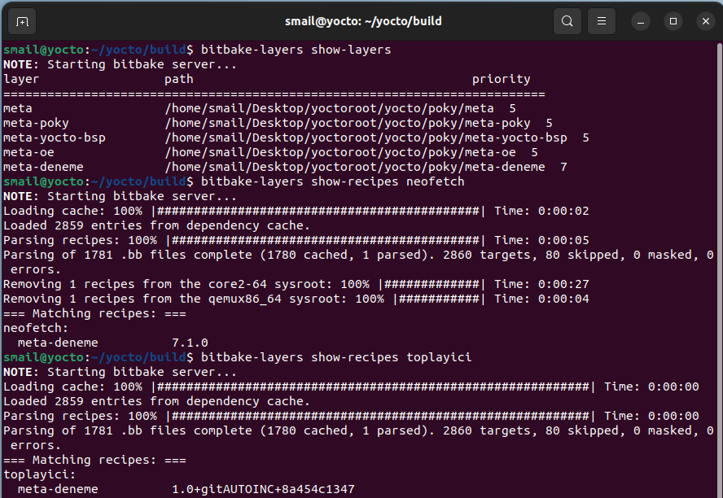
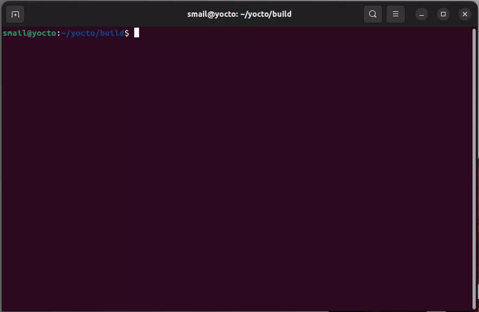
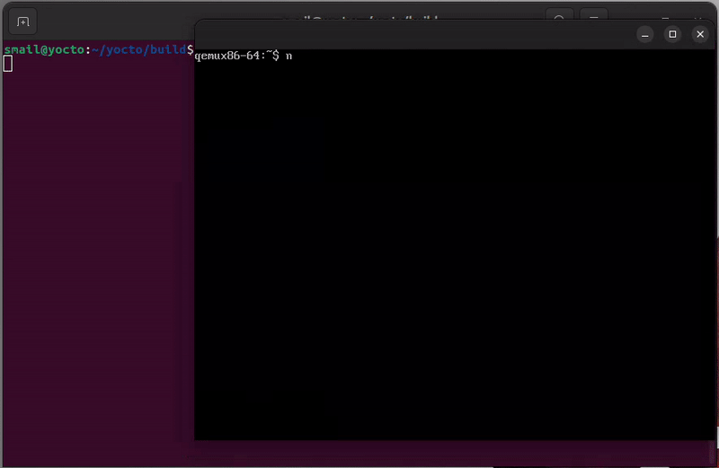
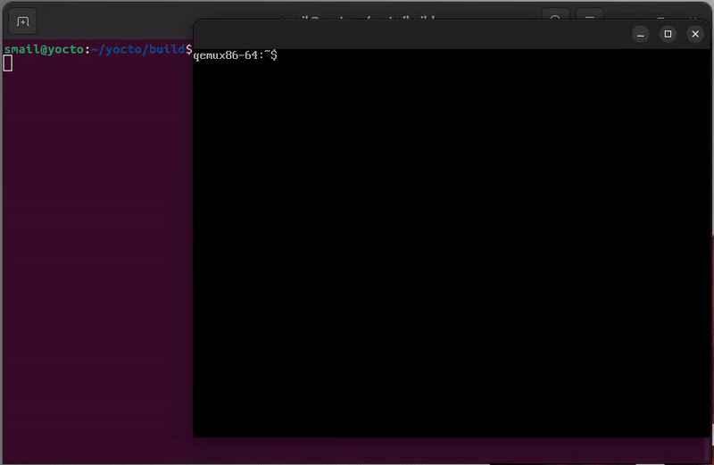

# YOCTO İLE QEMUDA ÇALIŞAN GÖMÜLÜ LINUX

**Qemu image'i `bitbake core-image-minimal` ile elde edildi.**

### Kendi eklediğim layer ve recipelerin bitbake tarafından çıktısı aşağıdaki fotodadır. Dosya yoluyla birlikte bu repoda bulunabilir.

### Qemu ile çalıştırma ve oluşturulan kullanıcı giriş işlemi

### Oluşturulan Recipe ile Yocto image de yüklü olan neofetch'in çalıştırılması

### [Toplayici uygulamasının](https://github.com/iiozen/bb-ornek) çalıştırılması

